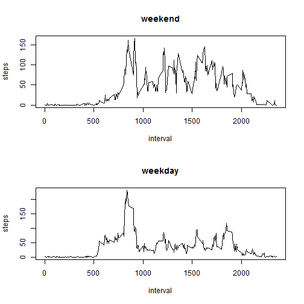

```r
setwd("D:/Work/Coursera/Data Science/5. Reproducible Research/project_1")
```
clear the workspace

```r
rm(list=ls())
```
reading csv file and saving data

```r
data <- read.csv("D:\\Work\\Coursera\\Data Science\\5. Reproducible Research\\project_1\\activity.csv", nrows=17568, header=T, sep=",", stringsAsFactors = FALSE, colClasses = c("numeric", "character","integer"))
```
Make a histogram of the total number of steps taken each day

```r
library(plyr)
library(dplyr)
```

```
## 
## Attaching package: 'dplyr'
```

```
## The following objects are masked from 'package:plyr':
## 
##     arrange, count, desc, failwith, id, mutate, rename, summarise,
##     summarize
```

```
## The following objects are masked from 'package:stats':
## 
##     filter, lag
```

```
## The following objects are masked from 'package:base':
## 
##     intersect, setdiff, setequal, union
```

```r
library(lubridate)
```

```
## 
## Attaching package: 'lubridate'
```

```
## The following object is masked from 'package:plyr':
## 
##     here
```

```r
library(ggplot2)
total.steps <- tapply(data$steps, data$date, FUN = sum, na.rm = TRUE)
data$date <- ymd(data$date)
```

*Part I
calculating Mean & Median

```r
mean(total.steps)
```

```
## [1] 9354.23
```

```r
median(total.steps)
```

```
## [1] 10395
```
first calculate steps taken per day

```r
steps <- data %>%
   filter(!is.na(steps)) %>%
   group_by(date) %>%
   summarize(steps = sum(steps)) %>%
   print 
```

```
## Source: local data frame [53 x 2]
## 
##          date steps
##        (time) (dbl)
## 1  2012-10-02   126
## 2  2012-10-03 11352
## 3  2012-10-04 12116
## 4  2012-10-05 13294
## 5  2012-10-06 15420
## 6  2012-10-07 11015
## 7  2012-10-09 12811
## 8  2012-10-10  9900
## 9  2012-10-11 10304
## 10 2012-10-12 17382
## ..        ...   ...
```
Making histograms

```r
library(ggplot2)
ggplot(steps, aes(x=date, y=steps))+geom_bar(stat="identity")+ xlab("Dates")+ ylab("Steps")+ labs(title= "Total numbers of Steps per day")
```


*Part II

```r
daily <- data %>%
   filter(!is.na(steps)) %>%
   group_by(interval) %>%
   summarize(steps=mean(steps)) %>%
   print
```

```
## Source: local data frame [288 x 2]
## 
##    interval     steps
##       (int)     (dbl)
## 1         0 1.7169811
## 2         5 0.3396226
## 3        10 0.1320755
## 4        15 0.1509434
## 5        20 0.0754717
## 6        25 2.0943396
## 7        30 0.5283019
## 8        35 0.8679245
## 9        40 0.0000000
## 10       45 1.4716981
## ..      ...       ...
```
Make a time series plot (i.e. type = "l") of the 5-minute interval (x-axis) and the average number of steps taken, averaged across all days (y-axis)


```r
plot(daily, type = "l")
```


Which 5-minute interval, on average across all the days in the dataset, contains the maximum number of steps?

```r
daily[which.max(daily$steps), ]$interval
```

```
## [1] 835
```

Imputing missing values

```r
missing <- sum(is.na(data))
```
Create a new dataset that is equal to the original dataset but with the missing data filled in

```r
new <- data %>%
   group_by(interval) %>%
   mutate(steps = ifelse(is.na(steps), mean(steps, na.rm=TRUE), steps))
summary(new)
```

```
##      steps             date               interval     
##  Min.   :  0.00   Min.   :2012-10-01   Min.   :   0.0  
##  1st Qu.:  0.00   1st Qu.:2012-10-16   1st Qu.: 588.8  
##  Median :  0.00   Median :2012-10-31   Median :1177.5  
##  Mean   : 37.38   Mean   :2012-10-31   Mean   :1177.5  
##  3rd Qu.: 27.00   3rd Qu.:2012-11-15   3rd Qu.:1766.2  
##  Max.   :806.00   Max.   :2012-11-30   Max.   :2355.0
```

Make a histogram of the total number of steps taken each day

```r
new.steps <- new %>%
   group_by(date) %>%
   summarize(steps = sum(steps)) %>%
   print  
```

```
## Source: local data frame [61 x 2]
## 
##          date    steps
##        (time)    (dbl)
## 1  2012-10-01 10766.19
## 2  2012-10-02   126.00
## 3  2012-10-03 11352.00
## 4  2012-10-04 12116.00
## 5  2012-10-05 13294.00
## 6  2012-10-06 15420.00
## 7  2012-10-07 11015.00
## 8  2012-10-08 10766.19
## 9  2012-10-09 12811.00
## 10 2012-10-10  9900.00
## ..        ...      ...
```

```r
ggplot(new.steps, aes(x=date, y=steps))+geom_bar(stat="identity")+ xlab("Dates")+ ylab("Imputed Steps")+ labs(title= "Total numbers of Steps per day (missing data imputed)")
```


Calculate and report the mean and median total number of steps taken per day.

```r
imputed.steps <- tapply(new$steps, new$date, FUN = sum, na.rm = TRUE)
new$date <- ymd(new$date)
mean(imputed.steps)
```

```
## [1] 10766.19
```

```r
median(imputed.steps)
```

```
## [1] 10766.19
```
Do these values differ from the estimates from the first part of the assignment?

```r
mean(total.steps)==mean(imputed.steps)
```

```
## [1] FALSE
```

```r
median(total.steps)==median(imputed.steps)
```

```
## [1] FALSE
```

```r
summary(total.steps)
```

```
##    Min. 1st Qu.  Median    Mean 3rd Qu.    Max. 
##       0    6778   10400    9354   12810   21190
```

```r
summary(imputed.steps)
```

```
##    Min. 1st Qu.  Median    Mean 3rd Qu.    Max. 
##      41    9819   10770   10770   12810   21190
```
What is the impact of imputing missing data on the estimates of the total daily number of steps? The estimates of the number of steps increased by 41, 3041, 370, 1416, 0, 0.

```r
summary(imputed.steps) - summary(total.steps)
```

```
##    Min. 1st Qu.  Median    Mean 3rd Qu.    Max. 
##      41    3041     370    1416       0       0
```

```r
par(mfrow=c(2,1))
hist(imputed.steps,col="red")
hist(total.steps,col="blue")
```


**Part III**
Are there differences in activity patterns between weekdays and weekends? For this part the weekdays() function may be of some help here. Use the dataset with the filled-in missing values for this part. Create a new factor variable in the dataset with 
two levels - "weekday" and "weekend" indicating whether a given date is a weekday or weekend day

```r
dayofweek <- function(date) {
   if (weekdays(as.Date(date)) %in% c("Saturday", "Sunday")) {
      "weekend"
   } else {
      "weekday"
   }
}
new$daytype <- as.factor(sapply(new$date, dayofweek))
```
Make a panel plot containing a time series plot (i.e. type = "l") of the 5-minute interval (x-axis)and the average number of steps taken, averaged across all weekday days or weekend days (y-axis).
See the README file in the GitHub repository to see an example of what this plot should look like using simulated data


```r
par(mfrow = c(2, 1))
for (type in c("weekend", "weekday")) {
   steps.type <- aggregate(steps ~ interval, data = new, subset = new$daytype == 
                              type, FUN = mean)
   plot(steps.type, type = "l", main = type)
}
```


